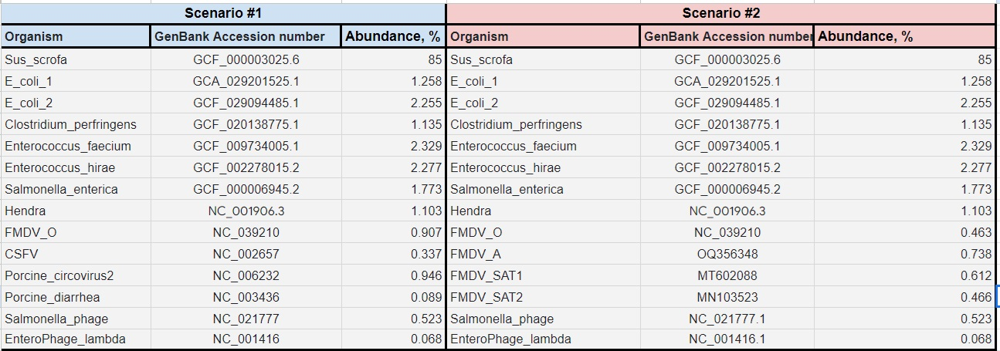

### Generate simulated data sets of samples with known composition:  

a.       Use NanoSim to generate simulated data sets (https://github.com/bcgsc/NanoSim)  

b.       We will simulate two scenarios:  

  **Scenario 1**: data set emulating sample with 7 distinct viral species with various relative abundance;

  **Scenario 2**: data set emulating sample with mixed infection of several strains of the same virus + 3 additional distinct viral species; we will use Foot-and-mouth disease virus (FMDV) as a model for our mixed infection case – this virus has 7 serotypes (strains) that can co-infect their host;

c.       Suggested relative abundance of viral/host/and other species in each simulated data set:  

**Scenario 1**: 85% host (Swine); 11% bacteria (E.coli; Clostridium); 4% viruses (7 different species with abundances from 1.103% to 0.068%);

**Scenario 2**: 85% host (Swine); 11% bacteria; 4% viruses (4 strains of FMDV – serotypes A, O, SAT1; 3 other distinct species of viruses)  
   

### To do list  
- [ ] Download reference genomes from GenBank (use accession numbers provided in the table above);   
- [ ] Update/put together required input files for simulation (update example files provided here);  
- [ ] Download pre-trained metagenomic (log) model from NanoSim repo;  
- [ ] Run simulator.py to produce 1000000 fastq reads (--fastq) using guppy basecaller and with chimeric reads included (--chimeric);  
- [ ] Combine generated 'aligned' and 'unaligned' reads into a single gz-compressed fastq file  
- [ ] Run FastQC on the simulated reads - check read lengths and quality scores;  
